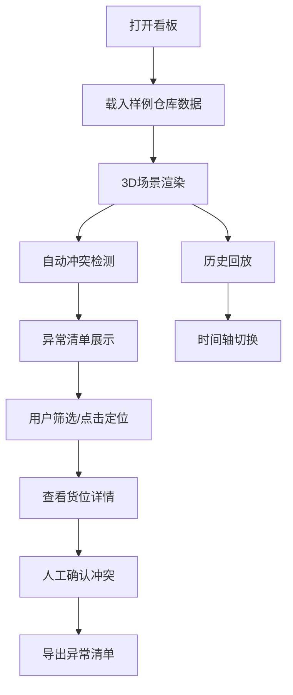

## 1. 产品概述

3D 仓库货位巡检看板是一个基于 Web 的三维可视化库存管理工具，通过 Three.js 技术将仓库货架、货位和托盘状态以 3D 形式呈现，支持库存快照查看、盘点记录、冲突检测与人工确认，帮助仓储管理人员直观高效地进行货位巡检和库存核查。

- 核心目标：提供沉浸式 3D 仓库视图，快速定位库存异常，支持盘点全流程管理
- 目标用户：仓储管理员、库存盘点员、物流运营人员
- 市场价值：降低人工盘点成本，提升库存准确性，加速异常问题定位与处理

## 2. 核心功能

### 2.1 用户角色

| 角色 | 注册方式 | 核心权限 |
|------|----------|----------|
| 仓储管理员 | 本地访问 | 导入布局配置、筛选查看、冲突检测、人工确认、历史回放、导出异常清单 |

### 2.2 功能模块

1. **3D 仓库场景**：货架、货位、托盘的三维可视化展示，支持旋转、缩放、平移交互
2. **布局配置导入**：支持 JSON 格式的仓库布局配置文件导入，内置样例仓库数据
3. **筛选功能**：按货架、货位状态、托盘状态等多维度筛选
4. **点击定位**：点击 3D 对象高亮选中，同步显示详细信息面板
5. **状态颜色**：不同状态对应不同颜色编码，直观展示库存状态
6. **冲突检测**：自动检测同一货位多托盘占用、重复托盘号、未知货位等异常
7. **人工确认**：对检测出的冲突进行确认处理，记录处理状态
8. **历史回放**：支持盘点记录时间轴回放，查看库存变化历程
9. **异常清单导出**：将检测到的异常导出为 CSV 格式文件
10. **刷新恢复**：浏览器刷新后保留筛选、确认状态、回放记录、导出数量和视角

### 2.3 页面详情

| 页面名称 | 模块名称 | 功能描述 |
|----------|----------|----------|
| 主看板页 | 3D 场景区 | 占据主要视图区域，展示仓库三维模型，支持鼠标交互 |
| 主看板页 | 顶部工具栏 | 布局导入按钮、筛选器、视角复位、刷新恢复状态 |
| 主看板页 | 左侧信息面板 | 选中对象详情、库存快照信息、盘点记录 |
| 主看板页 | 右侧异常面板 | 冲突检测结果列表、人工确认操作、导出按钮 |
| 主看板页 | 底部时间轴 | 历史回放控制、时间点切换、播放/暂停 |
| 主看板页 | 错误提示区 | 重复托盘号、未知货位、损坏配置、空数据集等错误提示 |

## 3. 核心流程

用户打开看板后，系统自动载入样例仓库布局数据，3D 场景渲染货架、货位和托盘。用户可通过筛选器过滤特定状态的货位或托盘，点击 3D 对象查看详情。系统自动检测库存冲突并在右侧异常面板列出，用户可对冲突进行人工确认处理。底部时间轴支持历史盘点记录回放，用户可导出异常清单。浏览器刷新后所有状态自动恢复。

## 4. 用户界面设计

### 4.1 设计风格

- **主色调**：工业蓝（#165DFF）作为主色，搭配深灰背景营造专业仓储管理氛围
- **状态色**：绿色（正常）、橙色（预警）、红色（冲突/异常）、蓝色（选中）、灰色（空置）
- **按钮风格**：圆角矩形按钮，悬停有轻微缩放和阴影变化
- **字体**：采用等宽字体显示编号和数据，提升数据可读性；正文使用现代无衬线字体
- **布局风格**：深色主题，左右分栏面板悬浮于 3D 场景之上，半透明玻璃态效果
- **图标风格**：线性风格图标，统一 24px 尺寸

### 4.2 页面设计概述

| 页面名称 | 模块名称 | UI 元素 |
|----------|----------|---------|
| 主看板页 | 3D 场景区 | 全屏 3D 渲染、网格地面、环境光、方向光 |
| 主看板页 | 顶部工具栏 | 导入按钮、状态筛选下拉、视角复位按钮、状态栏 |
| 主看板页 | 左侧面板 | 折叠式面板、详情卡片、数据列表、标签页 |
| 主看板页 | 右侧异常面板 | 异常列表、确认按钮、统计数字、导出按钮 |
| 主看板页 | 底部时间轴 | 时间刻度、播放控件、进度条、时间点标记 |
| 主看板页 | 错误提示 | Toast 通知、红色警示条、关闭按钮 |

### 4.3 响应式

- 桌面端优先设计，支持 1280px 及以上宽度
- 面板可折叠，小屏幕下自动收起非核心面板
- 3D 场景自适应窗口大小变化

### 4.4 3D 场景指引

- **环境与氛围**：深色工业风背景，柔和环境光，模拟仓库照明效果
- **光照设置**：环境光 + 方向光 + 半球光，确保 3D 对象清晰可见且有立体感
- **相机设置**：透视相机，初始视角为 45 度俯视角，支持轨道控制器旋转缩放
- **构图与焦点元素**：货架阵列居中布局，冲突货位以红色发光效果突出显示
- **交互与动画**：选中对象有轻微上浮动画，状态变化有颜色过渡效果，相机移动有阻尼
- **后处理效果**：轻微泛光效果增强科技感，选中对象辉光效果
- **资源与性能**：纯几何体构建，无需外部模型资源，确保百级货位流畅渲染
