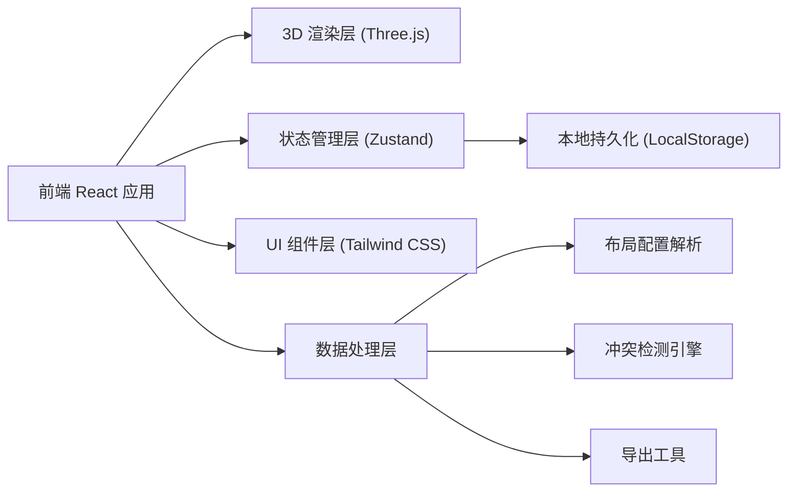

## 1. 架构设计



## 2. 技术说明

- **前端框架**：React@18 + TypeScript
- **构建工具**：Vite@5
- **样式方案**：Tailwind CSS@3
- **状态管理**：Zustand@4
- **3D 渲染**：Three@0.160 + @react-three/fiber@8 + @react-three/drei@9
- **路由**：React Router DOM@6（单页应用，可选）
- **后端**：无，纯前端应用，数据通过 JSON 文件导入
- **数据存储**：LocalStorage 本地持久化

## 3. 目录结构

```
src/
├── components/          # 组件目录
│   ├── layout/         # 布局组件（工具栏、面板等）
│   ├── scene/          # 3D 场景相关组件
│   ├── panels/         # 信息面板组件
│   └── common/         # 通用组件
├── store/              # Zustand 状态管理
│   └── useStore.ts
├── hooks/              # 自定义 Hooks
├── utils/              # 工具函数
│   ├── conflict.ts     # 冲突检测逻辑
│   ├── export.ts       # 导出功能
│   └── storage.ts      # 本地存储
├── data/               # 样例数据
│   └── sampleWarehouse.json
├── types/              # TypeScript 类型定义
│   └── index.ts
├── pages/              # 页面
│   └── Dashboard.tsx
├── App.tsx
├── main.tsx
└── index.css
```

## 4. 数据模型

### 4.1 核心数据类型

```typescript
// 货位状态
type SlotStatus = 'empty' | 'occupied' | 'conflict' | 'warning';

// 托盘状态
type PalletStatus = 'normal' | 'damaged' | 'expired' | 'unknown';

// 货架
interface Shelf {
  id: string;
  name: string;
  position: { x: number; z: number };
  rows: number;
  columns: number;
  levels: number;
}

// 货位
interface Slot {
  id: string;
  shelfId: string;
  row: number;
  column: number;
  level: number;
  status: SlotStatus;
}

// 托盘
interface Pallet {
  id: string;
  palletNo: string;
  slotId: string;
  status: PalletStatus;
  sku?: string;
  quantity?: number;
  lastCheckTime?: string;
}

// 盘点记录
interface InventoryRecord {
  id: string;
  timestamp: string;
  pallets: Pallet[];
  note?: string;
}

// 冲突类型
type ConflictType = 'duplicate_pallet' | 'multi_pallet_slot' | 'unknown_slot' | 'damaged_layout';

// 冲突记录
interface Conflict {
  id: string;
  type: ConflictType;
  description: string;
  relatedIds: string[];
  confirmed: boolean;
  confirmedAt?: string;
  confirmedBy?: string;
}

// 仓库布局配置
interface WarehouseLayout {
  version: string;
  name: string;
  shelves: Shelf[];
  slots: Slot[];
  pallets: Pallet[];
  inventoryRecords: InventoryRecord[];
}
```

### 4.2 持久化数据

```typescript
interface PersistedState {
  filters: {
    statusFilter: string | null;
    shelfFilter: string | null;
  };
  confirmedConflicts: string[];
  currentPlaybackIndex: number;
  exportCount: number;
  cameraPosition?: { x: number; y: number; z: number };
  cameraTarget?: { x: number; y: number; z: number };
  selectedSlotId?: string | null;
}
```

## 5. 状态管理设计

使用 Zustand 管理全局状态，包含：

- **warehouse**：当前仓库布局数据
- **conflicts**：检测出的冲突列表
- **filters**：当前筛选条件
- **selectedSlotId**：当前选中的货位 ID
- **playbackState**：历史回放状态
- **uiState**：UI 显示状态（面板展开/收起等）

状态通过中间件持久化到 LocalStorage，实现刷新恢复。

## 6. 冲突检测算法

1. **同一货位多托盘**：按 slotId 分组，统计每组托盘数量，大于 1 则标记冲突
2. **重复托盘号**：按 palletNo 分组，统计每组数量，大于 1 则标记冲突
3. **未知货位**：托盘的 slotId 在货位列表中不存在则标记冲突
4. **损坏布局配置**：导入 JSON 解析失败、数据结构不完整时标记
5. **空数据集**：货架或托盘数量为 0 时提示

## 7. 核心流程实现

- **布局导入**：FileReader 读取 JSON 文件 → 验证数据结构 → 更新 store → 触发 3D 场景更新
- **冲突检测**：数据变更后自动运行检测 → 生成冲突列表 → 更新异常面板
- **人工确认**：点击确认 → 更新 conflict.confirmed → 持久化存储
- **历史回放**：时间轴滑动 → 切换 inventoryRecords → 更新 3D 场景状态
- **导出清单**：筛选冲突 → 生成 CSV 文本 → 创建 Blob 下载
- **刷新恢复**：应用初始化 → 从 LocalStorage 读取状态 → 恢复筛选、确认、回放、视角
